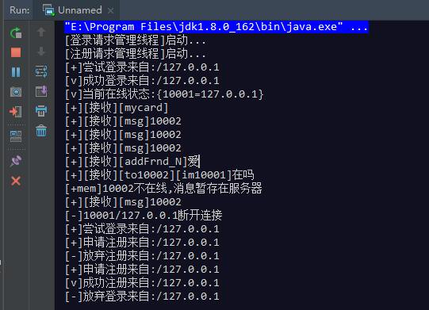

# CatCat聊天服务端
ChatCat聊天(服务端)，Swing+Socket(TCP)+MySQL，JavaSE课程项目。

## 客户端项目地址
[ChatCat_Client](https://github.com/LauZyHou/ChatCat_Client)

## 服务端运行展示

## 配置本项目
### 数据库服务器配置
这部分请见[ChatCat_Client](https://github.com/LauZyHou/ChatCat_Client)的README中的说明。
### 配置服务端连接数据库
在主类[ChatCat_Server/src/allServer/Main]中第10行配置数据库服务器的ip地址，数据库服务器只要和服务端在同一个局域网内都可以。

当时没考虑JDBC解耦，请在所有的类中找到连接数据库的部分，修改成适合自己环境的端口、scheme名、用户名、密码。

## 运行本项目
直接从主类[ChatCat_Server/src/allServer/Main]运行。

## 附注
ChatCat的客户端、数据库、服务端允许分离在不同的主机上，可以使用一台路由器建立局域网，在局域网内实现多线程聊天。